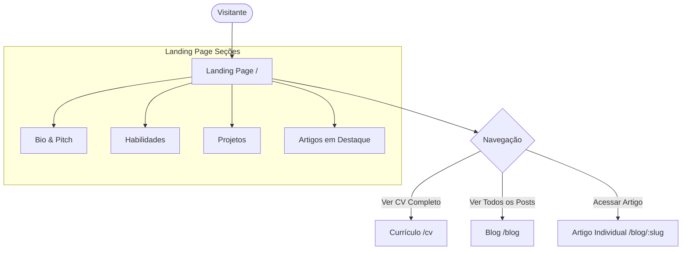

# Discovery 01 — Landing Page & Portfólio Retro-Cyberpunk com Astro

Este documento define o alinhamento de produto para a reformulação do portfólio de Nathan Amorim, integrando a Landing Page (LP) de conversão profissional, o currículo detalhado e o blog sob uma identidade visual unificada utilizando o framework **Astro**.

## 1. Visão Geral do Produto
O site pessoal de Nathan Amorim passará a ser uma plataforma unificada que atua em três frentes principais:
1. **Landing Page de Vendas (LP):** A página inicial com apelo profissional forte para se "vender" como Tech Lead & Solution Architect. Destacará suas habilidades, showcase de projetos, sua bio profissional e uma **seção de artigos em destaque do blog**.
2. **Currículo Detalhado (CV):** O currículo completo reestilizado no visual retrô, acessível por uma rota limpa e amigável (ex: `/cv`).
3. **Blog Técnico:** Espaço para artigos de tecnologia. A escrita de artigos será simplificada através de Markdown, mantendo a "Jornada de Harness Engineering" existente.

## 2. O Problema & Oportunidade
* **Problema:** O currículo anterior era um HTML estático longo com tema clássico azul corporativo. O blog possuía um design terminal retrô único, mas expandi-lo exigia criar novos arquivos HTML duplicando cabeçalhos e scanlines.
* **Oportunidade (Astro):** O framework Astro permite componentizar toda a moldura retrô do console (`.chrome`, `.crt-overlay`) e as scanlines em um layout único compartilhável. Ele possibilita criar novas postagens no blog escrevendo arquivos Markdown simples (`.md`), que são automaticamente integrados ao layout estático.

## 3. Público-Alvo e Usuários
* **Recrutadores de Tecnologia:** Que buscam validação rápida de senioridade, stack e histórico de conquistas no CV.
* **Potenciais Clientes e Parceiros:** Que buscam entender a senioridade técnica e liderança.
* **Comunidade Dev / Leitores do Blog:** Interessados nos artigos sobre engenharia de software e IA.

## 4. Roteamento do Produto (Autonomia de Páginas no Astro)
O Astro utiliza roteamento baseado no sistema de arquivos sob `src/pages/`, garantindo total autonomia e isolamento entre as páginas:
* `/` (`src/pages/index.astro`): Landing Page principal (Pitch, Competências, Projetos e Artigos em Destaque).
* `/cv` (`src/pages/cv/index.astro` ou `cv.astro`): Currículo detalhado e completo reestilizado.
* `/blog` (`src/pages/blog/index.astro`): Listagem completa das postagens.
* `/blog/[slug]` (`src/pages/blog/[slug].astro`): Artigos individuais renderizados dinamicamente a partir dos Markdowns da coleção.

