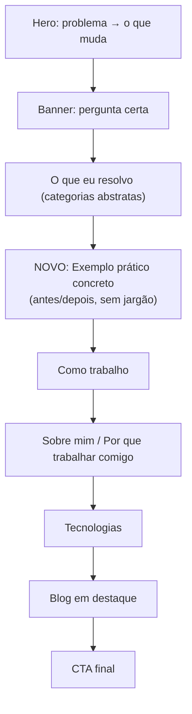

# Discovery 03 — Comunicação ainda tem ruído para público leigo

## 1. Contexto / Porquê
Após a `feat-12` (simplificação de navegação, remoção do currículo da
home), novo round de feedback: a comunicação da home **funciona bem para
o mundo corporativo**, mas quem não tem nenhuma noção de tecnologia ainda
tem dificuldade de entender. A `discovery-02` já havia identificado esse
padrão (técnico entende fácil, leigo não) e resolveu a parte estrutural
(currículo competindo por atenção). O feedback atual mostra que o
problema não era só estrutural — a **linguagem em si** ainda tem ruído
para quem não tem repertório técnico, mesmo depois da simplificação.

Importante: o usuário **não quer abrir mão do público corporativo** — a
comunicação atual funciona para esse público e precisa continuar
funcionando. Não é uma reescrita para simplificar tudo; é adicionar uma
camada que ajude o leigo sem perder o que já convence quem entende de
tecnologia.

## 2. Hipótese
As seções atuais ("O que posso desenvolver", "Como trabalho", "Sobre
mim") comunicam em nível de **categoria abstrata** ("Sistemas e produtos
digitais", "Integrações e automação", "entender o processo antes de
escrever código"). Isso é lido corretamente por quem já sabe traduzir
essas categorias pra situações reais (público corporativo/técnico), mas
para quem nunca pensou em "sistema" ou "automação" como conceito, essas
frases não ancoram em nada concreto — falta um **exemplo prático**,
tangível, que mostre a régua "problema do dia a dia → solução" sem
jargão.

Isso bate com a sugestão do próprio usuário: "talvez validar um exemplo
prático ou melhorar a comunicação, mas também quero público corporativo."

## 3. Para quem
Dois públicos que precisam conviver na mesma home, sem que atender um
prejudique o outro:
- **Leigo total** (dono de negócio local sem repertório técnico): precisa
  de um exemplo concreto, em linguagem de dia a dia, pra "ligar o ponto"
  entre o problema dele e o que o site oferece.
- **Corporativo/técnico** (empresa maior, gestor com algum repertório):
  já entende a comunicação atual — não pode virar infantilizada ou
  perder densidade a ponto de soar menos sério pra esse público.

## 4. Como (macro)
Adicionar uma seção de **exemplo prático concreto** (formato "antes e
depois" ou mini case, em linguagem 100% cotidiana, sem jargão técnico)
entre "O que eu resolvo" (categorias abstratas) e "Como trabalho"
(processo). A seção abstrata continua existindo para o público que já
entende — o exemplo prático serve de ponte/ancoragem pra quem não
entende, sem remover nem reescrever o que já funciona pro público
corporativo.

Formato sugerido: "Situação real → o que eu fiz → resultado", com nomes
genéricos/anonimizados se for baseado em cliente real, ou um cenário
hipotético claramente identificável como exemplo ilustrativo.

**Bloqueio:** este documento não inventa o exemplo prático em si — isso
exige um caso real (ou cenário aprovado) do usuário. Ver `criteria-03`
seção "Pendências" e `spec/decisions.md` (D2).

## 5. Critério de sucesso
- A home ganha uma seção de exemplo prático concreto, sem remover ou
  diluir as seções que já comunicam bem pro público corporativo.
- Leitura de teste com alguém sem repertório técnico consegue explicar
  com as próprias palavras "o que ele resolve" depois de ler só a nova
  seção — fora do escopo técnico deste documento, critério de validação
  de produto de longo prazo (mesma ressalva já feita na `discovery-02`).
