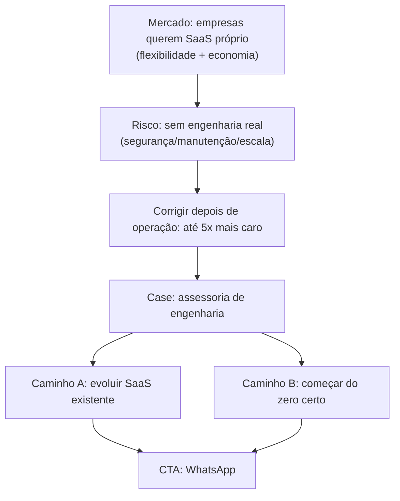

# Discovery 04 — Case "seu próprio SaaS, feito com engenharia de verdade"

## 1. Contexto / Porquê
O mercado mudou de padrão: empresas estão deixando de só assinar SaaS de
terceiros e passaram a querer **construir o próprio SaaS interno** —
motivado por flexibilidade (constrói só o que de fato precisa) e economia
de custo recorrente de licenças de terceiros.

O problema que o usuário observa nesse movimento: essas empresas tocam o
projeto sem passar pelas perguntas que a engenharia de software sempre fez
— segurança, manutenção, escala. O software "funciona" no curto prazo,
mas carrega dívida técnica invisível. Quando o problema aparece, o
sistema já está em operação (dados reais, usuários reais), e corrigir
nesse estágio custa até **5x mais** do que teria custado resolver de
início.

Esse diagnóstico é a motivação comercial: o usuário quer captar clientes
justamente nesse ponto de dor — antes que a conta de 5x apareça — e
quer isso publicado como **case no portfólio do site**, com comunicação
não técnica (o decisor que aprova esse tipo de projeto raramente é
técnico) que também funcione como peça de venda da assessoria.

## 2. Hipótese
Existe um público de decisores não técnicos (donos de negócio, diretores)
que já decidiu "vamos ter nosso próprio SaaS" mas não tem repertório para
avaliar se o time/fornecedor que vai construir isso vai entregar algo
sustentável ou uma bomba-relógio técnica. Esse público responde a uma
comunicação que:
- Nomeia o risco em termos de dinheiro e tempo, não em termos técnicos
  ("corrigir depois custa até 5x mais" fala mais alto que "dívida
  técnica" ou "débito arquitetural").
- Mostra que existe um caminho responsável, com alguém que já pensa em
  segurança/manutenção/escala desde o dia 1, não como retrabalho.

## 3. Para quem
- **Decisor não técnico** que já decidiu internalizar um SaaS (motivado
  por custo/flexibilidade) e está escolhendo quem constrói — precisa
  entender o risco de pular etapas de engenharia sem virar aula de
  arquitetura.
- Dois momentos de entrada distintos para esse mesmo público, que a
  comunicação precisa cobrir:
  1. **Já tem um SaaS rodando** e quer evoluir para o próximo nível
     (audit + evolução — resolver o que já foi feito sem base sólida).
  2. **Vai começar do zero** e quer a base certa desde o início (evitar
     a dívida antes dela existir).

## 4. Como (macro)
Adicionar um novo **case de portfólio** no site, em linguagem 100% não
técnica (mesmo padrão de "público leigo" já validado nas discoveries
02/03), estruturado como uma peça de venda de consultoria:
1. Nomear o cenário de mercado ("empresas querem seu próprio SaaS") e o
   motivo (flexibilidade + economia).
2. Nomear o risco concreto em R$/tempo: corrigir depois de operação
   custa até 5x mais, porque segurança/manutenção/escala não foram
   pensadas desde o início.
3. Oferecer os dois caminhos de entrada (evoluir SaaS existente / começar
   do zero com fundação certa) como chamada para ação — contato via
   WhatsApp, consistente com a missão do site (`constitution.md`).

Este case deve conviver com o portfólio técnico já existente
(`forge-sdd` em `projects.json`), mas com tom de venda de assessoria, não
de projeto técnico já entregue — é captação, não um case fechado com
resultado mensurado ainda.

**Bloqueio:** este documento não decide *onde* no site esse case entra
(nova seção na home vs. entrada em `projects.json`/`/cv` vs. página
dedicada) nem o texto final de venda — isso é decisão de arquitetura de
informação e de copy, tratado em `criteria-04` e `spec/decisions.md`.

## 5. Critério de sucesso
- O site passa a ter um case de portfólio comunicando esse cenário de
  mercado, em linguagem não técnica, cobrindo os dois caminhos de
  entrada (evoluir / começar do zero).
- O case termina em uma chamada para ação de contato, consistente com o
  restante do site (WhatsApp).
- Nenhuma seção técnica/corporativa existente é removida ou diluída —
  este é um case novo, adicionado ao portfólio já existente.
