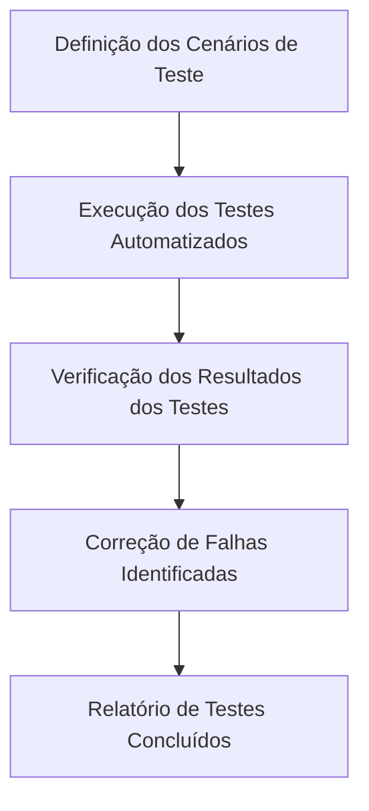

### Sessão de Discovery

#### Análise de Produto

**Problema:**
Identificar a necessidade de um fluxo de teste para garantir a qualidade e funcionalidade do site pessoal de Nathan Amorim.

**Valor de Negócio:**
Um fluxo de teste bem definido garante que todas as funcionalidades do site estejam funcionando conforme o esperado, proporcionando uma experiência de usuário consistente e confiável.

**Usuários Afetados:**
- Nathan Amorim: Proprietário do site.
- Visitantes do site: Usuários finais que utilizam o site para obter informações sobre Nathan Amorim.

**Fluxo Principal:**
1. Definição dos cenários de teste.
2. Execução dos testes automatizados.
3. Verificação dos resultados dos testes.
4. Correção de falhas identificadas.
5. Relatório de testes concluídos.

#### Análise Técnica

**Requisitos Técnicos:**
- Implementação de testes automatizados para as principais funcionalidades do site.
- Utilização de ferramentas de teste adequadas para o framework Astro e TypeScript.
- Integração contínua com GitHub Actions para execução automática dos testes.

**Impactos na Arquitetura:**
- Adição de uma nova pasta `tests` no projeto para armazenar os scripts de teste.
- Configuração de pipelines no GitHub Actions para execução dos testes automatizados.

**Critérios de Aceitação:**
- Todos os testes devem passar sem erros.
- Cobertura de testes deve ser superior a 90%.
- Relatório de testes deve ser gerado e disponibilizado após cada execução.

#### Roadmap Preliminar

**Tarefas Sugeridas:**
1. Criar a pasta `tests` e estruturar os cenários de teste.
2. Configurar ferramentas de teste (exemplo: Jest ou Cypress).
3. Escrever scripts de teste para cada funcionalidade do site.
4. Configurar GitHub Actions para execução automática dos testes.
5. Gerar relatório de cobertura de testes.

### Handoff Final

**Arquivos Criados:**
1. `sdd/discovery/discovery-01-teste-fluxo.md`
2. `sdd/discovery/criteria-01-teste-fluxo.md`
3. `sdd/discovery/plan-01-teste-fluxo.md`

**Focos Principais do Produto:**
- Garantir a qualidade e funcionalidade do site através de testes automatizados.
- Integração contínua com GitHub Actions para execução automática dos testes.
- Geração de relatório de testes para monitoramento e correção de falhas.

O próximo passo é criar a branch correspondente e iniciar a especificação da feature. Use o comando `/nova-feature` para prosseguir.
